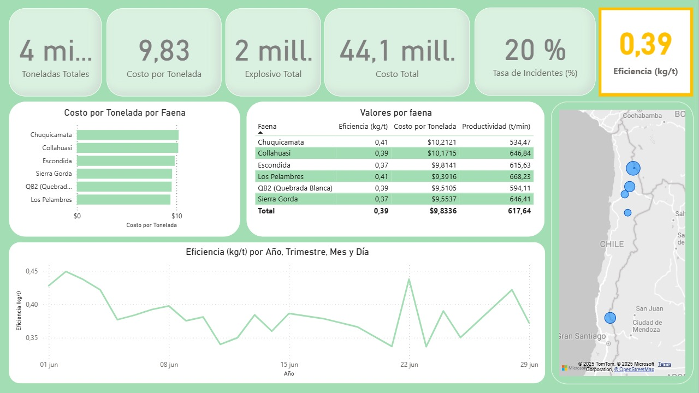

# Caso Simulado Enaex — Análisis Operacional

**Contexto:** Simulación de un escenario en minería para optimizar la gestión de indicadores operativos.  
**Acción:** Análisis exploratorio y cálculo de KPIs utilizando R, generación de dashboard y reporte ejecutivo.  
**Impacto:** Permite priorizar causas de ineficiencia y apoyar decisiones estratégicas en un entorno minero.

---

## Datos y supuestos
- Origen: Dataset **simulado** para efectos de portafolio.  
- Frecuencia: Mensual.  
- Limitaciones: Datos sintéticos, no representan valores reales.

---

## Reproducir
1. Clonar el repositorio.  
2. Instalar librerías de R necesarias: `tidyverse`, `lubridate`, `janitor`.  
3. Ejecutar el script principal en `/notebooks/` o abrir el dashboard en `/reports/`.  
4. Consultar el resumen ejecutivo: `/reports/Executive_Summary.pdf`.  

---

## Resultados
  

---

## KPIs analizados
- Disponibilidad de equipos  
- Utilización  
- Cumplimiento de plan  
- MTBF / MTTR  

---

## Próximos pasos
- [ ] Conectar con datos reales de operaciones mineras.  
- [ ] Ampliar análisis a mantenimiento predictivo.  
- [ ] Incorporar alertas automáticas por umbrales críticos.  

